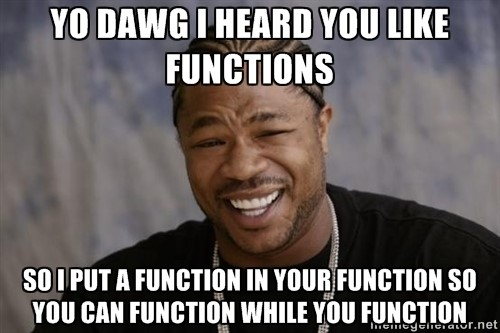

# Упражнение 3

## Lambda функции

Анонимни фукнции - удобни когато фукнцията, която дефинираме се използва само на едно място. Не е нужно да им измисляме име.

```scheme
(lambda (arg1 arg2 ... argn)
    body)

;; идентитет
(lambda (a) a)

;; функция, която при подадено число, връща следващото
(lambda (a) (+ a 1))

;; lambda функциите могат да бъдат извикани с аргументи 
;; веднага след дефиницията си
> ((lambda (a) (+ a 1)) 1) ;; => 2
```
## Функции от по-висок ред

Функциите в Scheme са "first-class citizens" - те могат да бъдат подавани наоколо, подобно на всички останали стойности (числа, списъци).

Функция от по-висок ред е тази, която приема функция като аргумент и/или връща функция като резултат.

```scheme
;; функция, която приема функция като аргумент
(define (apply1 func a b)
    (func a b))

> (apply1 + 1 2)     =>  3
> (apply1 expt 2 3)  =>  8
> (apply2 string-append "yo " " dawg") => "yo dawg"

;; функция, която връща функция като резултат
(define (apply2 func)
  (lambda (a b) (func a b)))

> (apply2 + 1 2) => error
;; apply2: arity mismatch;
;; the expected number of arguments does not match the given number
;; expected: 1
;; given: 3

> ((apply2 +) 1 2)     => 3
> ((apply2 expt) 2 3)  => 8
> ((apply2 string-append) "yo " "dawg") => "yo dawg"
```



## Accumulate

Функциите от по-висок ред допринасят за модулярността на програмата. Използването на функция, която е приложима в различни случаи, прави програмата по-четима от писането на сходни функции за всеки отделен случай.

```scheme
(define (accumulate operation null-value start end term next)
  (if (> start end)
      null-value
      (operation
            (term start)
            (accumulate operation null-value (next start) end term next))))

(define (accumulate-iter operation null-value start end term next)
  (if (> start end)
      null-value
      (accumulate-iter operation (operation null-value (term start)) (next start) end term next)))

(define (sum-interval start end)
  ???)

(define (prod-interval start end)
  ???)

(define (factorial number)
  ???)

(define (power base exp)
  ???)
```

---

## Задачи

1. Дефинирайте функция `(apply-twice func arg)`, която връща резултата от прилагането на функцията func 2 поредни пъти върху аргумента arg

    ```scheme
    (define (succ x) (+ x 1)) 

    > (double succ 1) => 3
    ```

2. Дефинирайте функция `(double func)`, която връща функция, прилагаща func два поредни пъти върху аргумента си

    ```scheme
    (define (succ x) (+ x 1))

    > ((double succ) 1) => 3
    ```

3. Дефинирайте функция `(flip f)`, която приема двуместна функция като аргумент и връща същата функция, но с разменени места на нейните аргументи

    ```scheme
    (define weird-minus (flip -))

    > (weird-minus 2 3) => 1
    ```

4. Дефинирайте функция `(compose f g)`, която приема като аргументи две едноместни функции и връща като резултат нова функция, представляваща тяхната композиция $f ∘ g$

    ```scheme
    (define (succ x) (+ x 1))
    (define (2* x) (* 2 x))

    > ((compose succ 2*) 5) => 11
    ```

## Задачи с accumulate

5. Дефинирайте функция `(double-factorial number)`, която изчислява $n!!$, използвайки дефинираната по-горе `accumulate`</br>  
    

6. Дефинирайте функция `(all? predicate? start end)` , която проверя дали всички цели числа в интервала start end изпълняват усовието `predicate`

7. Дефинирайте функция `(any? predicate? start end)`, която проверя дали някое цяло число в интервала start end изпълняват усовието `predicate`

