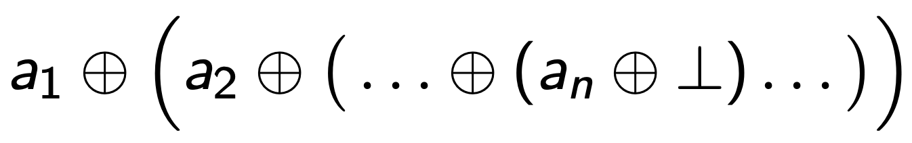
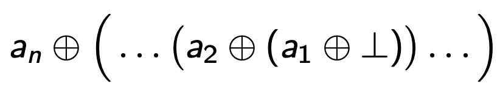

# Упражнение 5

## Функции от по-висок ред над списъци

#### map

```scheme
;; синтаксис - map приема функция и списък
;; прилага функцията над всеки елемент от подадения списък
;; връща нов списък
;; (map function list)

(map (lambda (x) (+ x 1)) '(1 2 3)) ;; => '(2 3 4)

(map car '((1 2 3) (4) (5 6) (7)))  ;; => '(1 4 5 7)

(map
    (lambda (f) (f 2))
    (list even? (lambda (x) (+ x 1)) list))
;; => '(#t 3 (2))
```

#### filter

```scheme
;; синтаксис - filter приема функция-предикат и списък
;; премахва елементите от списъка, които не изпълняват подаденото условие
;; връща нов списък
;; (filter predicate list)

(filter (lambda (x) (> x 4)) '(2 3 4 5)) ;; => '(5)
(filter pair? '(1 (2) (3 4 5))) ;; => '((2) (3 4 5))
```

#### foldr (дясно свиване)



```scheme
;; синтаксис - foldr приема функция, нулева стойност и списък
;; прилага подадената функция над елементите на list отдясно-наляво
;; (foldr function null-value list)

;; (foldr function null-value '(a1 a2 a3 .. an)) е еквивалентно на
;; (a1 function (a2 function (a3 function (... (an function null-value)))))

;; еквивалентно на (1 + (2 + (3 + (4 + 0))))
(foldr + 0 '(1 2 3 4)) ;; => 10

;; еквивалентно на (1 - (2 - (3 - (4 - 0))))
(foldr - 0 '(1 2 3 4)) ;; => -2

;; еквивалентно на горното
(foldr
    (lambda (curr accum) (- curr accum))
    0
    '(1 2 3 4))
;; => - 2

;; еквивалентно на (cons 1 (cons 2 (cons 3 (cons 4 '()))))
(foldr cons '() '(1 2 3 4) ;; => '(1 2 3 4)

;; "fold-right can be thought of as replacing the pairs in the spine of  
;; the list with procedure and replacing the () at the end with initial"
```

#### foldl (ляво свиване)



```scheme
;; синтаксис - foldl приема функция, нулева стойност и списък
;; прилага подадената функция над елементите на list отляво-надясно
;; (foldl function null-value list)

;; (foldl function null-value '(a1 a2 a3 .. an)) е еквивалентно на
;; (an function (... (a3 function (a2 function (a1 function null-value)))))

;; еквивалентно на (4 + (3 + (2 + (1 + 0))))
(foldl + 0 '(1 2 3 4)) ;; => 10

;; еквивалентно на (4 - (3 - (2 - (1 - 0))))
(foldl - 0 '(1 2 3 4)) ;; => 2

;; еквивалентно на горното
(foldl
    (lambda (curr accum) (- curr accum))
    0
    '(1 2 3 4))
;; => 2

;; еквивалентно на (cons 4 (cons 3 (cons 2 (cons 1 '()))))
(foldl cons '() '(1 2 3 4)) ;; => '(4 3 2 1)
```

---

## Задачи

1. Дефинирайте функция `(my-foldr func null-value lst)` (или `my-foldl`)

    ```scheme
    > (my-foldr + 0 '(1 2 3 4)) ;; => 10
    > (my-foldr cons '() '(1 2 3 4) ;; => '(1 2 3 4)

    > (my-foldl + 0 '(1 2 3 4)) ;; => 10
    > (my-foldl cons '() '(1 2 3 4)) ;; => '(4 3 2 1)
    ```

2. Дефинирайте функция `(my-map func lst)` чрез `fold`

3. Дефинирайте функция `(my-filter func lst)` чрез `fold`

4. Дефинирайте функция `(my-min lst)`, която връща най-малкото число в непразния списък `lst` чрез `fold`

5. Дефинирайте функция `(generate-interval start end)`, която по зададени начало и край, връща списък с всички целочислени числа в затворения интервал $[start, end]$

6. Дефинирайте функция `(zip lst1 lst2)`, която връща списък от наредени двойки:

    ```scheme
    > (zip '(1 2 3) '(#t #f)) ;; => '((1 . #t) (2 . #f))
    ```

7. Дефинирайте функция `(union lst1 lst2)`, която връща обединението на списъците `lst1` и `lst2` (без повторения)

    ```scheme
    > (union '(1 2 #t "test") '(2 3 #f "test"))
    ;; => '(1 2 #t "test" 3 #f)
    ```

8. Дефинирайте функция `(intersection lst1 lst2)`, която връща сечението на списъците `lst1` и `lst2` (без повторения)
    
    ```scheme
    > (intersection '(1 2 #t "test") '(2 3 #f "test"))
    ;; => '(2 "test")
    ```

9. Дефинирайте функция `(insertion-sort lst)`, която сортира списъка `lst` във възходящ ред.  
Упътване: дефинирайте преди това функция `(insert element sorted-lst)`, която поставя `element` на правилното място в сортирания списък `sorted-lst`
    
    ```scheme
    > (insert 3 '(1 2 6 7)) ;; => '(1 2 3 6 7)
    > (insertion-sort '(4 3 6 2 1 8 10)) ;; => '(1 2 3 4 6 8 10)
    ```

10. Дефинирайте функция `(chunk lst n)`, която разбива списъка `lst` на подсписъци с дължина `n`.  
Бележка: Последният подсписък може да е с дължина по-малка от `n`, ако дължината на `lst` не е кратна на `n`.

    ```scheme
    > (chunk '(1 1 1 2 2 2 3 4) 3)
    ;; => '((1 1 1) (2 2 2) (3 4))
    ```

11. Дефинирайте функция `(sublists lst)`, която намира всички подсписъци на `lst`

    ```scheme
    > (sublists '(1 2 3))
    ;; => '(() (1) (2) (3) (1 2) (2 3) (1 2 3)) в произволен ред
    ```

12. Дефинирайте функция `(subsets lst)`, която намира всички подмножества на `lst`

    ```scheme
    > (subsets '(1 2 3))
    ;; => '(() (1) (2) (3) (1 2) (1 3) (2 3) (1 2 3)) в произволен ред
    ```