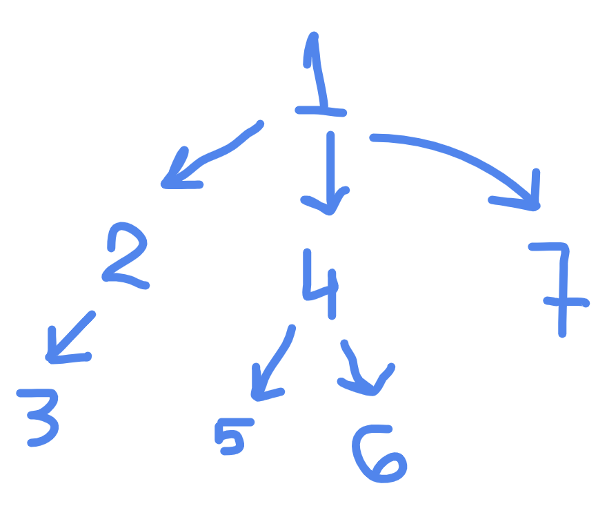

# Упражнение 14

## [Двоични дървета](../13/README.md#двоични-дървета)

```haskell
data BinaryTree a = EmptyTree | Node a (BinaryTree a) (BinaryTree a) deriving (Eq, Show, Read)

-- алтернативен запис с полета
-- data BinaryTree a = EmptyTree | Node { root :: a, left :: BinaryTree a, right :: BinaryTree a } deriving (Eq, Show, Read)
-- ако ползваме втория, имаме наготово дефинирани getter-и: root, left, right

-- пример за рекурсия над двоично дърво
-- prume е функция, която приема двоичн дърво,
-- връща ново двоично дърво, получено от първото
-- като премахва всички листа в него
prune :: BinaryTree a -> BinaryTree a
prune EmptyTree = EmptyTree
prune (Node _ EmptyTree EmptyTree) = EmptyTree
prune (Node root left right) =
  Node root (prune left) (prune right)
-- забелязваме как pattern matching-а се извършва по
-- конструкторите EmptyTree и Node
```

## Дървета с произволен брой наследници

```haskell
data Tree a = EmptyTree | Tree { rootTree :: a, subtrees :: TreeList a } deriving (Eq, Show, Read)

data TreeList a = None | SubTree { firstTree :: Tree a, restTrees :: TreeList a } deriving (Eq, Show, Read)

makeLeaf :: a -> Tree a  
makeLeaf x = Tree x None

mapTree :: (a -> b) -> Tree a -> Tree b
mapTree _ EmptyTree = EmptyTree
mapTree f (Tree x subtrees) =
    Tree (f x) (mapSubtrees f subtrees)

mapSubtrees :: (a -> b) -> TreeList a -> TreeList b
mapSubtrees _ None = None
mapSubtrees f (SubTree first rest) =
  Subtree (mapTree first) (mapSubtrees f rest)
```

---

## Задачи 



```haskell
tree :: Tree Int
tree =
  Tree 1
    (SubTree
      (Tree 2
        (SubTree (Tree 3 None) None))
    (SubTree
      (Tree 4
        (SubTree (Tree 5 None)
        (SubTree (Tree 6 None) None)))
    (SubTree (Tree 7 None) None)))
```

1. Дефинирайте функция `level index tree`, която връща списък от стойностите на възлите, намиращи се на дълбочина `index` от корена

2. Дефинирайте функция `depth tree`, която намира дълбочината на подаденото двоично дърво

3. Дефинирайте функция `countLeaves tree`, която намира броя на листата на подаденото двоично дърво

## [Подготовка за изпит](../exams/final-exam/)