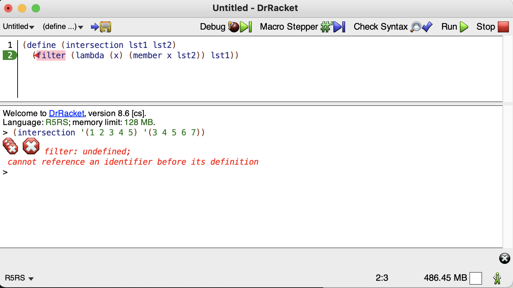
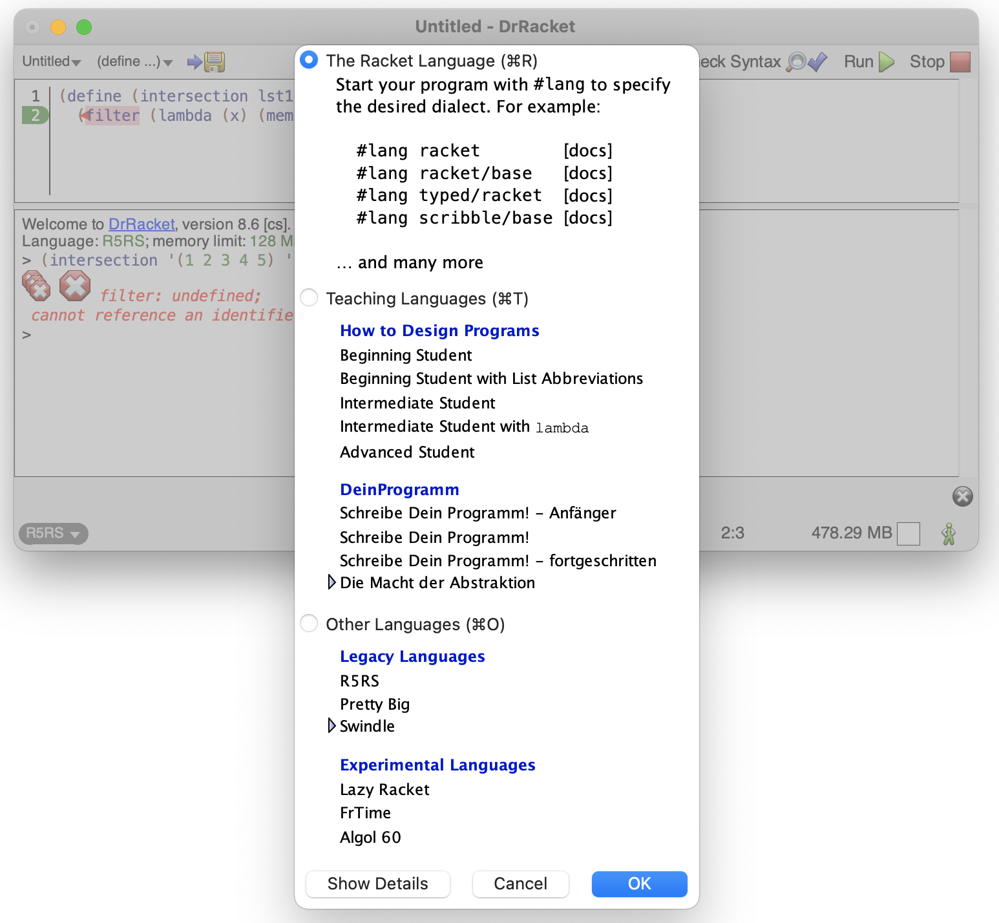
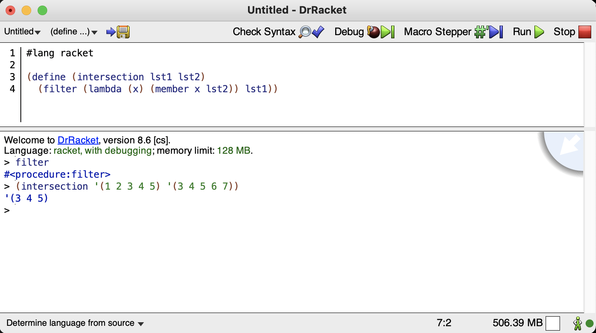

# Често срещани грешки при работа с DrRacket

### Искаме да използваме вградени в racket функции като filter, map, foldl

Проблем: Искаме да използваме вградената в racket функция `filter`, но получаваме `undefined identifier` грешка, защото всъщност използваме R5RS, а не racket (виж долу вляво).

Решение: Кликаме долу вляво -> Choose Language... -> The Racket Language. В началото на файла добавяме `#lang racket`.

